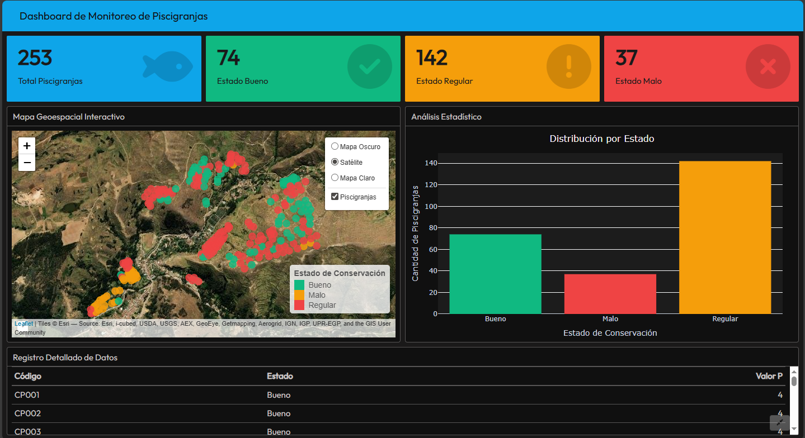

<div align="center">
  
  <br><br>
  
  # 🐟 Dashboard de Monitoreo de Piscigranjas
  
  **Sistema de Información Geográfica para la Gestión Acuícola**
  
  [](https://www.r-project.org/)
  [](https://rmarkdown.rstudio.com/flexdashboard/)
  [](https://leafletjs.com/)
  [](LICENSE)
  []()
  [](CONTRIBUTING.md)
</div>

---

## 📋 Tabla de Contenidos

*   [Introducción y Objetivos](#-introducción-y-objetivos)
*   [Arquitectura del Sistema](#-arquitectura-del-sistema)
*   [Estructura del Proyecto](#-estructura-del-proyecto)
*   [Guía de Instalación](#-guía-de-instalación)
*   [Manual de Usuario](#-manual-de-usuario)
*   [Solución de Problemas](#-solución-de-problemas)
*   [Hoja de Ruta (Roadmap)](#-hoja-de-ruta)
*   [Créditos y Contacto](#-créditos-y-contacto)

---

## 📖 Introducción y Objetivos

El **Dashboard de Monitoreo de Piscigranjas** es una solución tecnológica de alto nivel diseñada para centralizar, visualizar y analizar la información geoespacial relacionada con la infraestructura acuícola. Este proyecto nace de la necesidad de contar con herramientas ágiles para la fiscalización ambiental y la toma de decisiones basada en datos.

### 🎯 Objetivos del Proyecto
*   **Centralización**: Unificar el inventario de piscigranjas en una sola plataforma accesible.
*   **Monitoreo**: Proveer alertas visuales sobre el estado de conservación de las infraestructuras.
*   **Análisis**: Facilitar la interpretación de datos complejos mediante gráficos y tablas dinámicas.

---

## 🏗️ Arquitectura del Sistema

El sistema utiliza un enfoque de **"Código como Infraestructura"**.

*   **Motor de Procesamiento**: `R` (Lenguaje estadístico).
*   **Manejo Geoespacial**: Librería `sf` (Simple Features) para operaciones geométricas precisas y reproyecciones automáticas (UTM -> WGS84).
*   **Interfaz de Usuario**: `Flexdashboard` para un diseño responsive basado en rejillas.
*   **Visualización**: `Leaflet` (Mapas), `Plotly` (Gráficos), `DT` (Tablas).

---

## 📂 Estructura del Proyecto

Organización lógica de los directorios y archivos fuente:

```bash
proyecto_estadistico/
├── 📄 dashboard_piscigranjas.Rmd    # Lógica central en R Markdown
├── 📄 dashboard_piscigranjas.html   # Reporte compilado (Output)
├── 📄 requirements.R                # Script de instalación automatizada
├── 📄 analisis.png                  # Imagen de portada
├── 📄 .gitignore                    # Exclusiones de Git
├── 📄 CONTRIBUTING.md               # Guía para colaboradores
├── 📄 CODE_OF_CONDUCT.md            # Código de conducta
├── 📄 LICENSE                       # Licencia MIT
├── 📄 README.md                     # Documentación principal
└── 📁 capa/                         # ALMACÉN DE DATOS GIS
    ├── Piscigranjas_Finales.geojson # Dataset principal
    └── ...
```

---

## ⚙️ Guía de Instalación

Este manual asume el despliegue en un entorno local (Windows/Linux/Mac).

### Prerrequisitos
*   **R** (v4.2.0 o superior).
*   **RStudio IDE** (Recomendado).
*   **Git** (Opcional, para control de versiones).

### Paso 1: Clonar el Repositorio
```bash
git clone <URL_DEL_REPOSITORIO>
cd proyecto_estadistico
```

### Paso 2: Instalación de Dependencias
Ejecute el script de instalación en la consola de R:
```r
source("requirements.R")
```
> **Nota**: El script verificará e instalará automáticamente `sf`, `leaflet`, `flexdashboard`, etc.

### Paso 3: Compilación
Para generar el dashboard HTML:
```r
rmarkdown::render("dashboard_piscigranjas.Rmd")
```

---

## 🖥️ Manual de Usuario

### 1. Panel Informativo (KPIs)
Ubicado en la cabecera, ofrece métricas inmediatas:
*   🟦 **Total**: Inventario completo.
*   🟩 **Bueno** | 🟨 **Regular** | 🟥 **Malo**: Clasificación por estado operativo.

### 2. Visor Geográfico
*   **Navegación**: Zoom y desplazamiento fluido.
*   **Click-to-Detail**: Haga clic en cualquier punto para ver metadatos (Código, Valor P).
*   **Selector de Capas**: Alterne entre **Mapa Oscuro**, **Satélite** y **Terreno**.

### 3. Exploración de Datos
*   **Gráficos**: Barras interactivas con tooltips.
*   **Tabla Filtrable**: Búsqueda textual y ordenamiento por columnas.

---

## 🔧 Solución de Problemas

<details>
<summary><strong>El mapa aparece en blanco o gris</strong></summary>
Asegúrese de tener conexión a internet. Los proveedores de mapas base (CartoDB, Esri) requieren conexión online.
</details>

<details>
<summary><strong>Error instalando el paquete 'sf'</strong></summary>
En Windows, instale <strong>RTools</strong>. En Linux, instale las librerías del sistema: <code>libgdal-dev</code>, <code>libproj-dev</code>.
</details>

<details>
<summary><strong>Los caracteres especiales (tildes/ñ) se ven mal</strong></summary>
Verifique que su archivo fuente <code>.geojson</code> o <code>.csv</code> esté guardado con codificación <strong>UTF-8</strong>.
</details>

---

## 🛣️ Hoja de Ruta

*   [x] Visualización básica de puntos.
*   [x] Filtros por estado (Semáforo).
*   [ ] Integración con base de datos PostgreSQL/PostGIS.
*   [ ] Módulo de descarga de reportes en PDF.
*   [ ] Análisis de densidad (Heatmaps).

---

## 🤝 Créditos y Contacto

**Desarrollado y Mantenido por:**

### Felix Aldimar Aiquipa Gonzales
*Geomático & Especialista en Tecnologías GIS*

> "La tecnología al servicio de la sostenibilidad ambiental."

📧 **Email**: [Tu Email Aquí]  
🔗 **LinkedIn**: [Tu Perfil LinkedIn]

¿Te interesa colaborar? Revisa nuestro [CONTRIBUTING.md](CONTRIBUTING.md).

---
<div align="center">
  <sub>Copyright © 2025 Proyecto Estadístico. Bajo Licencia MIT.</sub>
</div>

